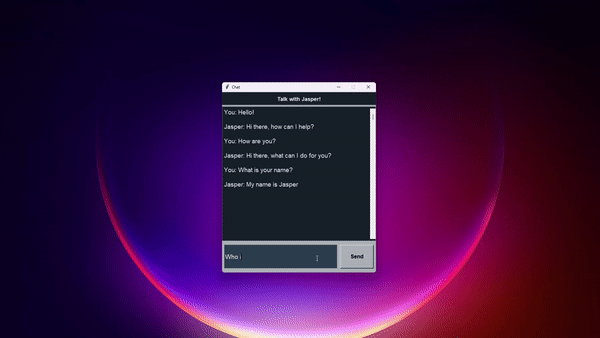

# Chatbot with TensorFlow, BERT and Tkinter



##  NLP Chatbot Project with TensorFlow, BERT and Tkinter

The Chatbot Model was trained with a simple Dataset and using TensorFlow and the BERT Transformer Model to Convert all the Words from the User to Numbers, and the U.I. was Built with Tkinter.

## Run it Locally

Test it Locally by running the `app.py` file, built with `Tkinter`. Remember first to run the `chatbot_code.ipynb` file to Train and Save the NLP Chatbot Model and then the `app.py` file.

## Chatbot App made with Tkinter
```sh
python3 app.py
```
